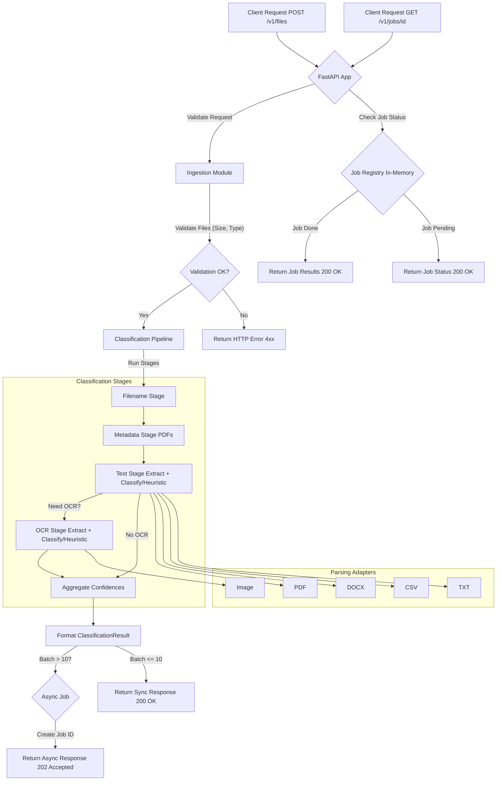

# HeronAI Document Classifier

A production-leaning document classification micro-service built with FastAPI, capable of scaling to millions of files per day while remaining simple, testable, and maintainable.

## 📚 Overview

HeronAI is a document classification service that intelligently categorizes diverse financial documents. It processes uploads through a multi-stage pipeline:

1. **Filename Analysis** → Quick heuristics based on filenames
2. **Metadata Extraction** → PDF metadata/EXIF analysis (currently PDF first page text)
3. **Text Content Analysis** → TF-IDF vectorization with Naive Bayes classification
4. **OCR Fallback** → Image-based text extraction when needed

The service processes files individually or in batches, providing confidence scores and detailed insights about the classification process.

## ✨ Features

- **Rich Format Support**: Actively parses **PDF, DOCX, CSV, TXT, and images (JPG/JPEG/PNG)**. See `ALLOWED_EXTENSIONS` to configure which types are accepted for upload.
- **Multi-stage Pipeline**: Intelligent classification with early-exit optimization
- **Batch Processing**: Process up to 50 files in one request
- **Async Job Support**: Background processing for larger batches (>10 files)
- **REST API**: Clean, versioned endpoints with OpenAPI documentation
- **Observable**: Structured logging and Prometheus metrics
- **Containerized**: Multi-stage Docker build for deployment flexibility

## ⚡ Quick Start (Docker Compose)

This is the recommended way to run the service locally, as it includes all dependencies (Redis, Postgres) defined in `docker-compose.yml`.

1. **Clone Repository**

2. **Create Environment File**: Copy the example and create your local `.env`:

   ```bash
   cp .env.example .env
   ```

   _(Optional)_: Edit `.env` if you need to change default ports or configurations.

3. **Generate API Key**: Create a secret API key and add it to your `.env` file.

   ```bash
   # Generate a key
   python scripts/generate_api_key.py --count 1
   # Copy the generated key
   ```

   Open `.env` and set `ALLOWED_API_KEYS` to the key you just copied, for example:
   `ALLOWED_API_KEYS=your_generated_api_key_here`

4. **Build and Run**: Start the services using Docker Compose.

   ```bash
   docker compose up --build
   ```

   This will build the `app` image (if it doesn't exist) and start the `app`, `redis`, and `db` containers.

5. **Access API Docs**: Once the services are running, open the interactive API documentation in your browser:
   [http://localhost:8000/docs](http://localhost:8000/docs)

6. **Test API Endpoint**: Use `curl` or the API docs UI to test the `/v1/files` endpoint. Make sure to include your API key in the `x-api-key` header.
   ```bash
   # Replace 'your_api_key_here' with the key from your .env file
   # Replace 'path/to/your/document.pdf' with an actual file path
   curl -X POST \
     "http://localhost:8000/v1/files" \
     -H "x-api-key: your_api_key_here" \
     -F "files=@path/to/your/document.pdf"
   ```

## 🛠️ Prerequisites

- Python 3.11+
- Git
- Docker & Docker Compose (Recommended for easy local setup)
- Tesseract OCR – required for the OCR fallback stage (included in Docker image)

## 🚀 Getting Started (Local Python Environment)

This setup runs the FastAPI application directly on your host machine. You'll need Python 3.11 and `pip` installed.

### Local Development Setup

```bash
# 1. Create and activate a virtual environment
python -m venv .venv
source .venv/bin/activate  # On Windows: .venv\Scripts\activate

# 2. Install dependencies
pip install -r requirements.txt

# 3. (Optional) Install pre-commit hooks for code quality checks
pre-commit install

# 4. Create a local environment file
cp .env.example .env
# Edit .env and set ALLOWED_API_KEYS (see Docker steps above)

# 5. Ensure Tesseract OCR is installed locally if not using Docker
#    (Installation instructions vary by OS: https://tesseract-ocr.github.io/tessdoc/Installation.html)

# 6. (One-time) Train the classification model
python scripts/train_model.py

# 7. Run the application with hot-reload
uvicorn src.api.app:app --reload
```

The application will be available at `http://localhost:8000`.

## 📖 Usage

### API Endpoints

- `POST /v1/files`: Upload and classify one or more files
- `GET /v1/jobs/{job_id}`: Retrieve results for asynchronous batch jobs
- `GET /v1/health`: Health check endpoint
- `GET /v1/version`: Version information
- `GET /metrics`: Prometheus metrics (when enabled)
- `GET /docs`: OpenAPI documentation (Swagger UI)

### Example: Classifying Files

```bash
# Classify a single file
curl -X POST \
  "http://localhost:8000/v1/files" \
  -H "x-api-key: your_api_key_here" \
  -F "files=@path/to/your/document.pdf"

# Classify multiple files
curl -X POST \
  "http://localhost:8000/v1/files" \
  -H "x-api-key: your_api_key_here" \
  -F "files=@path/to/file1.pdf" \
  -F "files=@path/to/file2.jpg" \
  -F "files=@path/to/file3.docx"
```

### Example Response (Single File)

```json
[
  {
    "filename": "invoice_may_2023.pdf",
    "mime_type": "application/pdf",
    "size_bytes": 84213,
    "label": "invoice",
    "confidence": 0.92,
    "stage_confidences": {
      "stage_filename": 0.8,
      "stage_metadata": 0.86,
      "stage_text": 0.92,
      "stage_ocr": null
    },
    "pipeline_version": "v0.1.0",
    "processing_ms": 137.45,
    "request_id": "218c2c4d-d8a4-4a27-a6b8-d20fb0afa7bd",
    "warnings": [],
    "errors": []
  }
]
```

## 🏗️ Architecture



## 📊 Environment Variables

| Variable                | Default                    | Description                                                 |
| ----------------------- | -------------------------- | ----------------------------------------------------------- |
| `DEBUG`                 | `false`                    | Enable verbose logging & FastAPI/Uvicorn hot-reload         |
| `ALLOWED_API_KEYS`      | `""`                       | Comma-separated static API keys (empty disables auth)       |
| `ALLOWED_EXTENSIONS`    | `pdf,docx,csv,txt,jpg,...` | Comma-separated **accepted** file extensions for upload     |
| `MAX_FILE_SIZE_MB`      | `10`                       | Maximum size per file in Megabytes                          |
| `MAX_BATCH_SIZE`        | `50`                       | Maximum number of files per batch request                   |
| `CONFIDENCE_THRESHOLD`  | `0.65`                     | Minimum confidence score to assign a label (else "unsure")  |
| `EARLY_EXIT_CONFIDENCE` | `0.95`                     | Score threshold for filename/metadata stages to skip others |
| `PROMETHEUS_ENABLED`    | `true`                     | Toggle `/metrics` endpoint (requires Prometheus libs)       |
| `PIPELINE_VERSION`      | `v0.1.0`                   | Semantic version embedded in API responses                  |
| `COMMIT_SHA`            | `None`                     | Git commit SHA (often set via CI/CD for tracking)           |

## 🧪 Testing

```bash
# Run linting, type checking, and tests (with coverage)
./scripts/lint.sh && python -m pytest

# Run only tests
python -m pytest

# Run tests with coverage report (HTML + XML for CI)
python -m pytest --cov=src --cov-report=html --cov-report=xml
```

Coverage reports are written to `htmlcov/` and `coverage.xml`. The CI pipeline enforces a minimum coverage threshold (see `pytest.ini`).

## 📁 Project Structure

```
files/            # Synthetic data files
src/
  api/            # FastAPI app, routers, schemas
  ingestion/      # File validation & streaming helpers
  parsing/        # Adapters for PDF, DOCX, CSV, TXT, Images (OCR)
  classification/ # Pipeline orchestrator, stages, ML model wrapper, confidence logic
  core/           # Core components: config, logging, shared exceptions
  utils/          # Utility functions: auth helpers, etc.
scripts/          # Helper scripts: model training, data generation, testing
tests/            # Unit and integration tests
```

## 🔒 Security & Auth

API authentication is handled via the `x-api-key` header, validated against the `ALLOWED_API_KEYS` environment variable (comma-separated list). If `ALLOWED_API_KEYS` is empty or not set, authentication is **disabled**.

## 📚 Additional Documentation

For more details, see:

- [Limitations & Future Work](docs/limitations.md): Discusses current constraints and potential improvements.
- [Frontend Setup Guide](docs/frontend_setup.md): Outlines how to build a React/TypeScript UI.
- [API Docs](http://localhost:8000/docs): Live Swagger UI documentation (when running).
