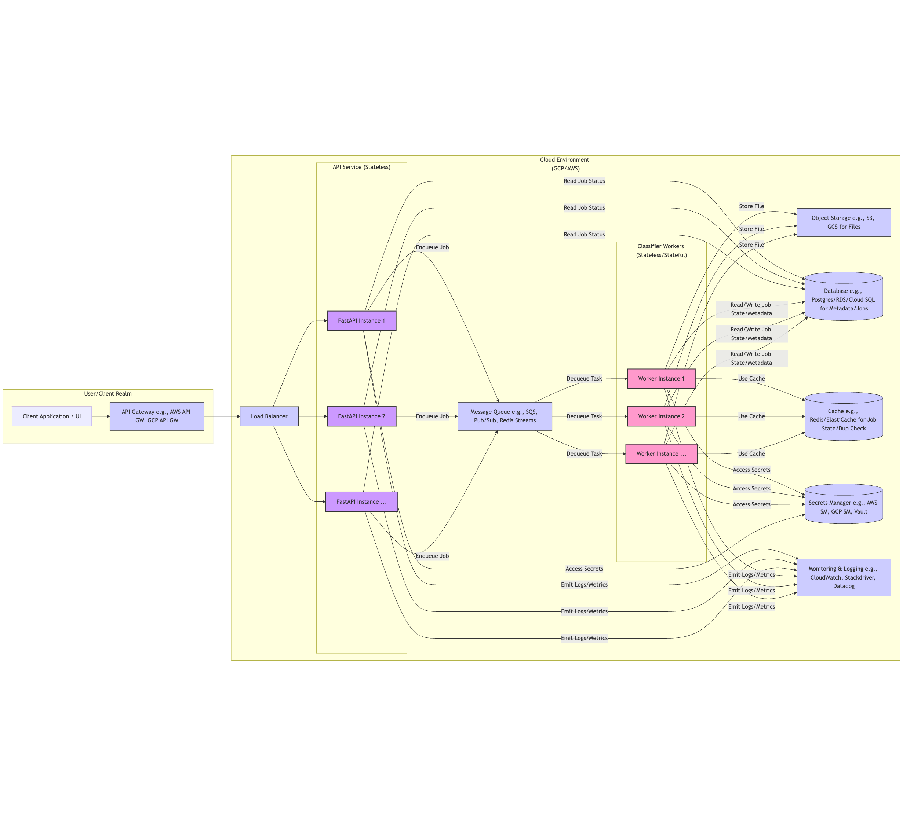
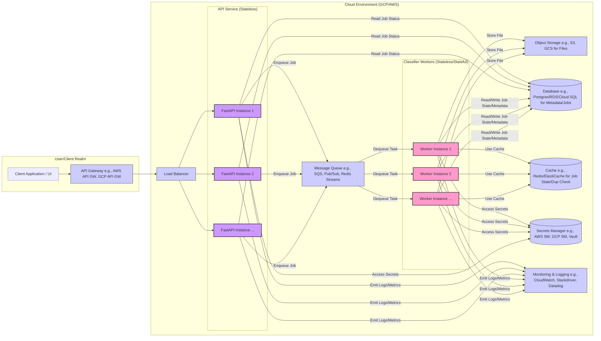

# HeronAI Document Classifier: Limitations, Future Work & Productionization

This document outlines the current limitations of the HeronAI document classification service, proposes extensions to address them, and discusses key considerations for deploying this service in a production environment. It serves as both a transparent assessment of the system's constraints and a roadmap for future enhancements and deployment strategies.

## Table of Contents

- [Current Limitations](#current-limitations)
  - [Classification Accuracy](#classification-accuracy)
  - [Robustness](#robustness)
  - [Scalability](#scalability)
  - [Feature Completeness](#feature-completeness)
  - [Security](#security)
- [Proposed Extensions](#proposed-extensions)
  - [ML Enhancements](#ml-enhancements)
  - [Architecture Improvements](#architecture-improvements)
  - [Feature Additions](#feature-additions)
  - [Security Enhancements](#security-enhancements)
- [Prioritized Roadmap](#prioritized-roadmap)
- [Productionization Considerations](#productionization-considerations)
  - [Conceptual Production Architecture Diagram](#conceptual-production-architecture-diagram)
  - [Cloud Deployment (GCP/AWS using Terraform)](#cloud-deployment-gcpaws-using-terraform)
  - [Robustness & Reliability](#robustness--reliability)
  - [Scalability](#scalability-1)
  - [Security](#security-1)
  - [CI/CD for Production](#cicd-for-production)
  - [Data Management & Persistence](#data-management--persistence)
  - [Cost Optimization](#cost-optimization)
  - [Interoperability & Accessibility](#interoperability--accessibility)

## Current Limitations

### Classification Accuracy

1. **Limited Training Data**: The current synthetic data generator produces a relatively small corpus (~3,000 samples) with simplistic patterns that may not reflect the complexity and variety of real-world documents.

2. **Naive Bayes Limitations**: While efficient, the Multinomial Naive Bayes model assumes feature independence, which doesn't hold for text data where word co-occurrences matter.

3. **Heuristic Fallbacks**: The regex-based stage fallbacks provide decent coverage but are brittle when facing documents with ambiguous or unexpected content patterns.

4. **OCR Quality**: The base Tesseract implementation works well for clean images but degrades with poor quality scans, skewed text, or unusual fonts. Preprocessing (deskewing, noise reduction) could improve this.

5. **No Language Awareness**: The current implementation assumes English text and doesn't account for multi-language documents or non-Latin scripts.

### Robustness

1. **Error Handling Gaps**: While the system has structured error handling, certain edge cases (like corrupted files that pass initial validation but fail during parsing) might cause unhandled exceptions or incomplete processing.

2. **Limited Retry Logic**: The current retry mechanism is simulated rather than fully implemented for all failure modes (e.g., transient network issues during OCR calls if external).

3. **No Real Circuit Breakers**: The system lacks protection against cascading failures if dependent services (e.g., a future external metadata service) degrade.

4. **In-Memory Job Storage**: Async jobs are stored in memory, making them vulnerable to service restarts or scaling events. A persistent store (like Redis or a database) is needed.

### Scalability

1. **Single-Process Limitation**: The current design operates within a single process, limiting throughput to the capacity of one server, especially for CPU-bound tasks like OCR or complex ML inference.

2. **No Persistent Queue**: Large batch processing uses in-memory background tasks rather than a durable message queue (like RabbitMQ, SQS, Pub/Sub), limiting reliability and scalability.

3. **Potential Memory Issues**: While streaming is attempted, certain parsing libraries might still load significant data into memory, limiting scalability for very large or complex files.

4. **Request-Response Coupling**: Synchronous classification ties up server resources for the entire processing duration, limiting concurrency.

### Feature Completeness

1. **Limited File Types**: The service currently supports text extraction for **PDF, DOCX, CSV, TXT, and raster images (JPG/JPEG/PNG)**. Other extensions accepted at upload (`doc`, `xls`, `xlsx`, `xlsb`, `md`, `xml`, `json`, `html`, `eml`) lack specific parsers and fall back, yielding low-confidence results.

2. **No Content Extraction**: The classifier identifies document types but doesn't extract structured data fields (e.g., invoice amounts, bank statement transactions, form fields).

3. **Single Label Classification**: Documents receive only one label. Multi-label or hierarchical classification isn't supported.

4. **No Continuous Learning**: The model is static after training. There's no mechanism to improve from user feedback or corrections.

### Security

1. **Basic Authentication**: The API key approach lacks features like rotation, scoping, rate limiting per key, or short-lived credentials.

2. **No PII Detection/Redaction**: The system doesn't identify or redact sensitive information (PII/PHI) in processed documents.

3. **Demo-Grade Security**: Several production security measures (e.g., file encryption at rest, comprehensive audit logging) are documented but not implemented.

## Proposed Extensions

### ML Enhancements

1. **Advanced Models**: Replace/augment Naive Bayes with transformer-based models (e.g., LayoutLM, BERT, DistilBERT) for improved understanding of document context and structure.

2. **Transfer Learning**: Leverage pre-trained document understanding models fine-tuned on specific classification tasks and domains.

3. **Active Learning Pipeline**: Implement a feedback loop where low-confidence classifications are flagged for human review, with corrections feeding back into model retraining.

4. **Ensemble Approaches**: Combine multiple specialist models (e.g., layout-aware, text-based, metadata-based) for more robust classification.

5. **Multi-language Support**: Integrate language detection and use appropriate language-specific models or multilingual models.

6. **Improved OCR**: Integrate OCR preprocessing steps (deskewing, denoising, binarization) and potentially explore alternative OCR engines or cloud-based OCR services for higher accuracy.

### Architecture Improvements

1. **Distributed Processing**:

   - Implement a durable message queue (e.g., RabbitMQ, Redis Streams, SQS, Pub/Sub) for reliable asynchronous processing.
   - Decouple API ingestion from processing using worker services (e.g., Celery, Argo Workflows, KEDA-scaled jobs).
   - Implement a coordinator service or state machine to manage job distribution and status tracking.

2. **Streaming Architecture**:

   - Ensure end-to-end streaming processing, especially for large files, potentially using chunked uploads directly to object storage (S3/GCS) via presigned URLs.
   - Adapt parsing libraries or strategies to work on streamed data where possible.

3. **Caching Layer**:

   - Add Redis caching for duplicate document detection based on content hash (SHA256).
   - Cache classification results for identical content hashes to avoid redundant processing.
   - Consider caching ML model predictions for identical text inputs if beneficial.

4. **Resilience Patterns**:
   - Implement proper circuit breakers (e.g., using `pybreaker` or framework integrations) for external dependencies (future databases, APIs).
   - Implement robust exponential backoff with jitter for all retryable operations (network calls, transient processing failures).
   - Add comprehensive health checking (liveness, readiness probes) for worker nodes and dependent services.

### Feature Additions

1. **Document Understanding**:

   - Extend the pipeline to extract structured data (key-value pairs, tables) from classified documents using techniques like layout analysis, NER, or specialized models.
   - Add entity recognition for key fields (dates, amounts, names, addresses, account numbers).
   - Implement document segmentation to identify functional blocks (header, footer, tables, paragraphs) in complex layouts.

2. **Multi-label & Hierarchical Classification**:

   - Allow documents to be assigned multiple relevant labels (e.g., "invoice" and "contract").
   - Implement hierarchical classification (e.g., financial→statement→bank).
   - Provide confidence scores per category rather than a single overall score.

3. **API Enhancements**:

   - Add a bulk document comparison endpoint (e.g., find duplicates).
   - Implement search capabilities across processed document metadata or extracted text.
   - Add webhook notifications for asynchronous job completion.

4. **Interactive Training UI**:
   - Build an admin interface (e.g., using React/Vue) for reviewing low-confidence classifications.
   - Add tools for annotating new training examples or correcting misclassifications.
   - Provide model performance dashboards and monitoring tools.

### Security Enhancements

1. **Advanced Authentication/Authorization**:

   - Implement JWT-based authentication with short-lived access/refresh tokens.
   - Add OAuth2/OIDC support for integration with identity providers.
   - Implement Role-Based Access Control (RBAC) for different API operations (upload, read, admin).
   - Introduce scoped API keys with specific permissions.

2. **Document Security**:

   - Implement client-side encryption or server-side encryption (SSE) for documents stored at rest (e.g., in S3/GCS).
   - Integrate PII detection and automatic redaction capabilities (using libraries like `presidio` or cloud services like AWS Comprehend/GCP DLP).
   - Support document watermarking for tracking provenance.

3. **Compliance & Auditing**:

   - Implement comprehensive audit logging for all document access and processing operations, stored securely.
   - Define and enforce data retention policies and automatic purging mechanisms.
   - Add features to generate compliance reports (e.g., for GDPR, HIPAA if applicable).

## Prioritized Roadmap

Based on impact vs. implementation complexity, here's a suggested prioritization:

### Phase 1: Core Reliability & Scalability (1-3 months)

- Implement durable message queue (e.g., Redis Streams or SQS/Pub/Sub) and Celery/equivalent workers for asynchronous processing.
- Move job state management from in-memory to Redis/database.
- Implement robust retry logic with backoff for key operations.
- Implement document hashing (SHA256) for duplicate detection caching.
- Improve OCR quality with basic pre-processing steps (e.g., using OpenCV).

### Phase 2: Classification Enhancements (2-4 months)

- Integrate a simple transformer-based model (e.g., DistilBERT fine-tuned on text) alongside Naive Bayes.
- Add basic language detection and route to appropriate models/heuristics if needed.
- Implement a simple feedback mechanism (e.g., an API endpoint to flag misclassifications).
- Add parsing support for 1-2 more common file types (e.g., basic `.xls`/`.xlsx` via pandas/openpyxl).

### Phase 3: Feature Expansion (3-6 months)

- Build a basic structured data extraction pipeline for a key document type (e.g., invoice amount/date).
- Implement multi-label classification support (model and API changes).
- Integrate PII detection for common entities.
- Develop a simple admin UI for reviewing flagged classifications.

### Phase 4: Enterprise Readiness (4-8 months)

- Implement advanced authentication (JWT/OAuth2) and RBAC.
- Add comprehensive audit logging and compliance features.
- Enhance admin dashboard with performance monitoring and retraining triggers.
- Harden security (WAF, secrets management, encryption at rest).
- Develop a customer-facing API portal/documentation site.

This prioritization balances quick wins with strategic long-term improvements, focusing first on reliability and core classification quality before expanding to new features and enterprise capabilities.

## Productionization Considerations

Moving the HeronAI Document Classifier from a demo/prototype to a robust, scalable, and secure production system requires careful planning across several dimensions. This section outlines key considerations based on the project's tech stack (Python/FastAPI, potentially React/TypeScript) and common cloud deployment patterns (GCP/AWS with Terraform).

### Conceptual Production Architecture Diagram

**Diagram Explanation:**

- **Clients** interact via an **API Gateway**, providing security, rate limiting, and routing.
- A **Load Balancer** distributes traffic across multiple instances of the stateless **FastAPI API Service**.
- The API service validates requests, potentially handles small synchronous tasks, and **enqueues** larger classification jobs onto a **Message Queue**. It can also query the **Database** for job status.
- **Classifier Workers** pull tasks from the queue. They perform the heavy lifting (parsing, OCR, ML inference).
- Workers interact with **Object Storage** (for raw files if persisted), the **Database** (for job metadata, results), a **Cache** (for job state, deduplication), and **Secrets Manager**.
- Both API and Worker services emit **Logs and Metrics** to a centralized monitoring system.
- The entire infrastructure within the cloud environment should be managed via **Terraform**.

### Cloud Deployment (GCP/AWS using Terraform)

- **Infrastructure as Code (IaC):** Use Terraform to define and manage all cloud resources (compute, storage, networking, queues, databases, IAM roles, etc.). This ensures consistency, repeatability, and version control for the infrastructure. Structure Terraform code using modules for reusability (e.g., VPC module, database module, compute module).
- **Managed Services:** Prefer managed services to reduce operational overhead:
  - **Compute:** GKE/EKS (Kubernetes), Cloud Run/App Runner (Serverless Containers), or EC2/Compute Engine with Auto Scaling Groups. Choose based on control vs. management trade-offs. Kubernetes offers flexibility but higher complexity; serverless containers are simpler for stateless web apps.
  - **Storage:** S3/GCS for durable, scalable file storage. Use lifecycle policies for cost management.
  - **Queues:** SQS/Pub/Sub for reliable, scalable message queuing. Choose standard or FIFO based on ordering requirements.
  - **Database:** RDS/Cloud SQL (Postgres) for relational metadata, job tracking, audit logs. Consider read replicas for scaling read load.
  - **Cache:** ElastiCache/Memorystore (Redis) for caching job states, session data, or duplicate hashes.
- **Networking:** Define a Virtual Private Cloud (VPC) with public and private subnets. Place databases and sensitive resources in private subnets. Use Security Groups / Firewall Rules to control traffic flow strictly. Deploy the API behind a Load Balancer (ALB/ELB/Cloud Load Balancer).
- **Container Registry:** Use ECR/GCR/Artifact Registry to store Docker images securely.

### Robustness & Reliability

- **Health Checks:** Implement comprehensive liveness and readiness probes for API instances and workers within the container orchestrator (Kubernetes, ECS). Readiness probes should ensure the service is fully initialized (e.g., ML models loaded) before receiving traffic.
- **Redundancy:** Deploy services across multiple Availability Zones (AZs) for high availability. Configure auto-scaling groups or managed services to handle AZ failures.
- **Distributed Tracing:** Implement distributed tracing (e.g., using OpenTelemetry with Jaeger, AWS X-Ray, Google Cloud Trace) to track requests across the API, queue, and workers for easier debugging of performance bottlenecks and errors.
- **Idempotency:** Design worker tasks and API endpoints to be idempotent where possible, especially for operations involving external state changes, to handle retries safely.
- **Graceful Shutdown:** Implement graceful shutdown logic (e.g., using FastAPI's `lifespan` events, `signal` handlers in workers) to finish processing in-flight requests/tasks before terminating during deployments or scaling events.
- **Incident Response:** Have a clear plan for monitoring, alerting, and responding to production incidents.

### Scalability

- **Auto-Scaling:** Configure auto-scaling for both the API service and the worker pool based on metrics like CPU utilization, memory usage, queue depth (for workers), or request latency. KEDA (Kubernetes Event-Driven Autoscaling) can be useful for scaling workers based on queue length.
- **Decoupling:** The asynchronous architecture with a message queue is fundamental for scaling. It allows the API and workers to scale independently based on their specific loads.
- **Database Scaling:** Use managed database services with read replicas. Implement connection pooling (e.g., using PgBouncer or SQLAlchemy's built-in pooling) to manage database connections efficiently. Consider sharding or partitioning strategies if metadata grows extremely large.
- **Stateless Services:** Design the API and worker services to be as stateless as possible. Store state in external systems (database, cache, queue) to facilitate horizontal scaling.
- **CDN:** If serving a frontend or static API documentation, use a Content Delivery Network (CDN) like CloudFront or Cloudflare to cache assets closer to users.

### Security

- **IAM Best Practices:** Follow the principle of least privilege when configuring IAM roles/permissions for services and users interacting with cloud resources. Use service accounts/instance profiles instead of embedding credentials.
- **Secrets Management:** Store all sensitive configuration (API keys, database passwords, signing keys) securely using AWS Secrets Manager, GCP Secret Manager, or HashiCorp Vault. Inject secrets into applications at runtime, not in Docker images or environment variables directly visible in the orchestrator.
- **Network Security:** Use security groups/firewall rules to restrict traffic between services to only necessary ports and protocols. Place public-facing services behind a Web Application Firewall (WAF) like AWS WAF or Cloud Armor for protection against common web exploits (SQLi, XSS). Implement DDoS protection.
- **Dependency Scanning:** Integrate tools like `pip-audit`, Snyk, or GitHub Dependabot into the CI/CD pipeline to scan for vulnerabilities in Python dependencies. Generate and store Software Bill of Materials (SBOM).
- **Input Validation:** Apply rigorous input validation at the API boundary (already partially done with Pydantic and `validate_file`) to prevent injection attacks or malformed data propagation.
- **Encryption:**
  - **In Transit:** Enforce HTTPS for all external communication (API Gateway, Load Balancer). Use TLS for internal communication between services where necessary.
  - **At Rest:** Enable encryption for data stored in Object Storage (SSE-S3/SSE-GCS or CMEK) and managed databases. Consider application-level encryption for highly sensitive data within files if required.
- **Auditing & Pen Testing:** Conduct regular security audits and penetration tests to identify vulnerabilities.

### CI/CD for Production

- **Environment Promotion:** Implement separate CI/CD pipelines for different environments (e.g., development, staging, production). Promote artifacts (Docker images, Terraform plans) through environments after successful testing and approvals.
- **Deployment Strategies:** Use strategies like Blue/Green or Canary deployments for production releases to minimize downtime and risk. Automate rollback procedures.
- **Infrastructure Automation:** Integrate Terraform plan/apply steps into the CI/CD pipeline, potentially requiring manual approval for production changes. Use tools like `tfsec` or `checkov` to scan Terraform code for security issues.
- **Testing in Pipeline:** Include automated integration tests and potentially end-to-end tests against a staging environment within the CI/CD pipeline before deploying to production.
- **Secrets in CI/CD:** Use secure methods (like OIDC connectors or temporary credentials) for CI/CD pipelines to access cloud resources or secrets managers, avoiding long-lived static credentials.

### Data Management & Persistence

- **Database Backups:** Configure automated backups for the production database (e.g., RDS/Cloud SQL point-in-time recovery and snapshots). Regularly test the restore process.
- **Object Storage Lifecycle:** Define lifecycle policies for files stored in S3/GCS to automatically transition older data to cheaper storage tiers (e.g., Infrequent Access, Glacier/Archive) or delete it after a defined retention period.
- **Data Retention:** Establish clear data retention policies for job metadata, classification results, and potentially the raw files, based on business needs and compliance requirements. Implement automated cleanup jobs.
- **Disaster Recovery:** Have a documented disaster recovery plan covering data loss and service unavailability scenarios.

### Cost Optimization

- **Monitoring:** Use cloud provider cost management tools (Cost Explorer, Budgets) and potentially third-party tools to monitor spending. Tag resources appropriately for cost allocation.
- **Right-Sizing:** Regularly review resource utilization (CPU, memory, database instances) and adjust sizes to match the actual workload, avoiding over-provisioning.
- **Storage Tiers:** Utilize appropriate storage tiers in S3/GCS based on access frequency.
- **Spot Instances:** Consider using Spot Instances (EC2/GCP) for stateless, fault-tolerant worker tasks to significantly reduce compute costs, but implement robust handling for instance termination.
- **Serverless:** Evaluate serverless options (Lambda/Cloud Functions, Cloud Run) where appropriate, as they can be cost-effective for event-driven or variable workloads (pay-per-use).

### Interoperability & Accessibility

- **API Gateway:** Use an API Gateway (AWS API Gateway, Apigee/GCP API Gateway) to manage API keys, enforce rate limiting, handle authentication/authorization uniformly, potentially transform requests/responses, and provide a stable entry point for consumers.
- **API Versioning:** Implement a clear API versioning strategy (e.g., `/v1/`, `/v2/` in the URL path) to allow for backward-incompatible changes without breaking existing clients.
- **Documentation:** Maintain up-to-date, comprehensive API documentation (OpenAPI spec generated by FastAPI is a good start) accessible to consumers. Consider hosting a dedicated developer portal.
- **Frontend Integration (React/TypeScript on Vercel):**
  - **CORS:** Configure Cross-Origin Resource Sharing (CORS) correctly on the FastAPI backend (or API Gateway) to allow requests from the Vercel frontend domain.
  - **Authentication:** Determine how the frontend will authenticate with the backend API (e.g., passing the API key securely, using JWT tokens obtained via an auth flow). Avoid exposing static API keys directly in frontend code.
  - **API Client:** Use a robust data fetching library in React (like React Query or SWR) to handle API requests, caching, state management, and error handling effectively.
